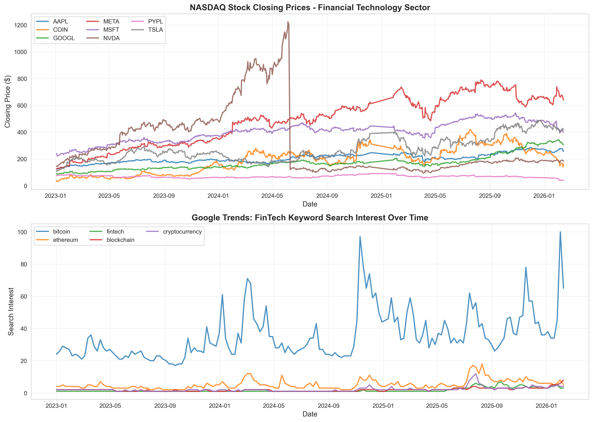
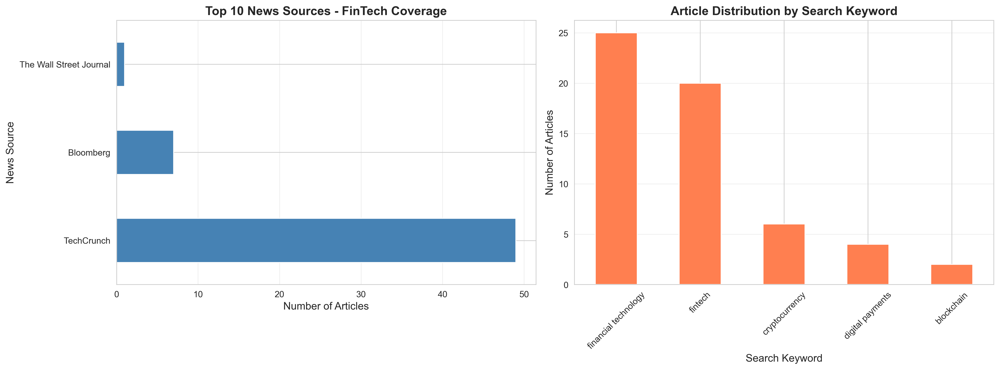
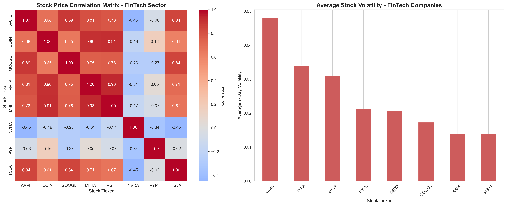

#  Answers

Nifra Wahaj | 25280002

---
## Part 1 Questions

### (a) 
**Data Heterogeneity: Explain how your chosen data sources represent different data types (structured, semi-structured, unstructured). Provide concrete examples from your extracted data.**


**Structured Data: NASDAQ Stock Prices (Kaggle)**
The NASDAQ dataset represents structured data with a tabular schema. Every record contains exactly six fields with consistent data types across all 6016 rows. Each row follows an identical structure with no nested objects or optional fields.

*Example:*
```
ticker,date,open,high,low,close
AAPL,2023-01-03,130.28,130.9,124.17,125.07
AAPL,2023-01-04,126.89,128.656,125.08,126.36
```

**Structured Data: Google Trends (PyTrends)**

The data is structured, returning tabular time series data with fixed columns. Every record has a date field followed by numerical search interest scores for each keyword. The schema remains constant across all 163 time periods extracted.

*Example:*
```
date,bitcoin,ethereum,fintech,blockchain,cryptocurrency
2023-01-01,24,4,1,2,2
2023-01-08,26,4,1,2,2
2023-01-15,29,5,1,2,2
```

**Semi Structured Data: NewsAPI Articles**

It returns JSON data with nested objects and variable field presence. The source field contains a nested dictionary with id and name properties, while fields like author and urlToImage may be present or null depending on the article.

*Example:*

```json
{
  "source": {
    "id": "techcrunch",
    "name": "TechCrunch"
  },
  "author": "Lorenzo Franceschi-bicchierai",
  "title": "Fintech lending giant Figure confirms data breach | TechCrunch",
  "description": "The company said hackers downloaded...",
  "urlToImage": "https://techcrunch.com/wp-content/uploads/...",
  "publishedAt": "2026-02-13T21:04:03Z",
  "content": "Figure Technology, a blockchain-based lending company...",
  "search_keyword": "fintech"
}

```

---

### (b)

**Extraction Challenges: Discuss specific technical or practical challenges encountered while accessing different data sources (rate limits, authentication, data format inconsistencies, etc.)**

Each data source presented unique challenges that required specific mitigation strategies:

**1.NewsAPI (API Data)**

NewsAPI requires authentication via API key and imposes rate limits. On the free plan: 
- Only 100 requests/day
- 1 request/second maximum
- Cannot query beyond 30 days back
- Results capped at 100 articles per request

To work within these constraints I implemented sequential keyword processing rather than parallel batching, used the pageSize=100 parameter to maximize articles per request and added error handling to catch and gracefully handle rate limit exceptions. The most significant data quality issue was the inconsistent content field, which NewsAPI often truncates with markers like "[+961 chars]" instead of providing full article text. The cleaning logs showed that all 57 articles had text lengths clustering tightly around 214 characters (mean=214.02, std=0.30), indicating systematic truncation rather than natural variation in article length.This limitation meant I couldn't perform comprehensive text analysis as originally planned. Also data format handling was a challenge. The API returns nested JSON with the source field as a dictionary and dates come in ISO 8601 format. I standardized all dates using `pd.to_datetime()` with error handling and normalized missing values to pandas NaN to ensure consistency with the other datasets.


**2. Google Trends (PyTrends)**

The pytrends library required implementing a 2 second delay between requests to avoid temporary IP blocks which increased the overall extraction time. The API also limits each query to a maximum of 5 keywords. I batched keywords in groups of 5 and wrapped all API calls in try except blocks for error handling. I also specified precise date ranges to get daily granularity and removed the 'isPartial' metadata column that appears in some responses.

**3. NASDAQ Data (Kaggle)**

This presented structural complexity rather than API limitations. The dataset organization was ambiguous and I had to write fallback logic to handle both individual ticker files and potential combined CSV files as the exact file structure wasn't documented. The logs show that I successfully located individual ticker files for eight of my nine target tickers (AAPL, MSFT, GOOGL, TSLA, NVDA, META, COIN, PYPL) but the file for Square (SQ) was not found in the dataset. This required defensive programming to handle missing tickers without failing the entire extraction. The dataset was also substantially larger than needed, containing 44,694 total rows across all time periods, which I filtered down to 6,016 records matching my date range of January 2023 to February 2026. However, the quality assessment revealed zero missing values, zero duplicates, and no data validation errors like impossible price relationships. This simplified my transformation pipeline but also meant I couldn't demonstrate handling of messy data issues.

---

### (c)
**Storage Justification: Explain why storing data in multiple formats (CSV, JSON) is valuable in a data engineering context. When would you choose one format over another?**


Storing data in multiple formats is valuable because different formats optimize for different use cases. CSV works best for flat, tabular data like NASDAQ stock prices. It's human readable, compatible with Excel/SQL and efficient for numerical analysis. JSON preserves nested structures like NewsAPI's source metadata and integrates well with APIs and NoSQL databases.

NewsAPI data stored only as CSV would require flattening the nested source object into separate columns (inflexible) or serializing it as a string (not queryable). JSON maintains the original hierarchy for future flexibility. Similarly, NASDAQ prices are naturally tabular and benefit from CSV's compactness, while Google Trends data fits either format since it's already tabular.

Beyond individual use cases, multiple formats provide redundancy, if one format corrupts, the other enables recovery. They also match different downstream workflows: business analysts prefer CSV for dashboards, ML engineers prefer JSON for MongoDB ingestion. The minimal storage overhead outweighs the benefits in flexibility and future proofing.

For choosing between formats: use CSV for flat numerical time-series (compact and widely compatible) and JSON for nested/hierarchical data (preserves structure). JSON is standard for API communication and handles schema changes well, while CSV is simpler for human inspection and SQL database ingestion. Version control prefers text based CSV for diffability, while NoSQL systems like MongoDB expect JSON natively.


---

## Part 2 Questions

### (a) 

**Cleaning Rationale: Justify your data cleaning decisions. Why were specific approaches chosen for handling missing data or outliers?** 


**NewsAPI Data**


For NewsAPI data, I dropped rows  where `title` or `description` is missing as an article without them has no analytical value. For missing values of `content` field, I filled it  with the description text as while full article content is valuable, the description often captures the essential information and allows me to retain more records. Similarly, I filled missing `author` information with "Unknown" rather than dropping these records, because author identity isn't critical. I removed duplicates based on URL since the same article appeared multiple times when different keywords matched it. Dates were standardized to datetime format. 

**NASDAQ Data (Kaggle)**
I implemented validation to drop rows with missing OHLC prices, records where high <  low (physically impossible) and negative prices (data corruption indicators). I preserved statistical outliers because extreme price movements can represent legitimate market events like stock splits or crashes. However, the quality assessment revealed zero missing values, zero duplicates and no validation errors. My checks removed zero records, confirming the kaggle dataset was already well curated. While this prevented me from demonstrating handling of messy data, the validation framework represents defensive programming essential for pipelines where data quality may degrade over time or vary between sources. The fact that no records were removed validates my choice of a high quality data source.

**Google Trends**
This required no cleaning because search interest data is complete by design and zero values are informative rather than missing.


---

### (b) Visualization Insights

**Visualization Insights: What key insights or patterns emerge from your visualizations? How do they relate to your chosen thematic domain?**

**Reference: visualizations/temporal_analysis.png**


Top plot shows NASDAQ stock prices show trends from 2023-2026. NVIDIA exhibits the most dramatic movement, peaking in mid 2024 before sharp correction. Most other stocks (AAPL, MSFT, META) show steady upward trends through 2024, with some volatility emerging in 2025-2026. TSLA remains relatively stable between $100-300 throughout the period. 
Bottom subplot shows search interest over time. Bitcoin dominates public search interest, frequently reaching 60-100 on the interest scale. Others (blockchain, fintech, ethereum) remain relatively flat below 20 throughout the entire period. Two major Bitcoin search spikes occurred in late 2024 and early 2026, both reaching maximum interest of 100, likely corresponding to major cryptocurrency market events. 
Comparing the two subplots reveals limited correlation between search interest and stock prices. While Bitcoin search spikes dramatically in late 2024 and early 2026, COIN's stock price doesn't show corresponding peaks, suggesting public search interest may lag behind or precede actual market movements rather than moving in lockstep

**Reference: visualizations/categorical_analysis.png**


This shows FinTech stories are distributed across media outlets and topics. The left chart shows TechCrunch dominates FinTech coverage with approximately 50 articles, significantly outpacing traditional financial outlets like Bloomberg and The Wall Street Journal. This indicates that technology-focused media treats FinTech as a primary editorial focus, while traditional finance publications cover it more selectively. 
The right chart reveals that broad FinTech terminology drives the most coverage, with "financial technology" generating 25 articles and "fintech" producing 20 articles. More specific technical terms like "cryptocurrency" (6 articles) and "blockchain" receive less mainstream media attention. This distribution suggests FinTech has achieved widespread adoption as a business concept beyond its initial crypto roots. 


**Reference: visualizations/correlation_analysis.png**


The correlation heatmap on the left reveals critical sector dynamics. Strong positive correlations (dark red, 0.90+) exist between COIN, META, and MSFT which suggests these companies move together as part of broader tech sector trends. However NVDA shows negative or near zero correlations (ranging from -0.45 to -0.06) with most other stocks, indicating it responds to different market drivers despite being a technology company. 
The volatility chart on the right provides the most actionable insight as COIN shows average 7 day volatility of approximately 4.8% which is more than triple that of the likes AAPL and MSFT. This difference illustrates that while crypto and traditional FinTech operate in adjacent spaces, they represent fundamentally different risk.


---

### (c) 

**Visualization Critique: What limitations exist in your current visualizations? How could they be improved for different audiences (technical vs. business stakeholders)?** 


**Limitation 1: Overlapping lines in temporal analysis**
The plot's eight overlapping stock price lines make individual tracking nearly impossible, with similar colors blending together. Also, missing volume data prevents assessing whether price movements occurred on significant trading activity. The bottom subplot is clearer due to Bitcoin's dominance but the four other keywords remain indistinguishable below 20.This could be mitigated by adding hover tooltips (date, price, volume, percent change) and range selectors for zooming. Also, annotatation can be added to spikes with corresponding market events. For business stakeholders, only top 3 performing stocks could be filtered, or use of small multiples (one subplot per stock). Also, all lines could be normalized to percent change from baseline for easier comparison.

**Limitation 2: Missing context in categorical analysis**
Both bar charts display frequencies accurately but lack analytical depth. The source chart shows TechCrunch's dominance without indicating whether this concentration is problematic. The keyword chart reveals broad FinTech terms outpace crypto terminology but doesn't show temporal patterns or whether topics surged during specific events.
To fix this a Gini coefficient can be added, quantifying media concentration. Also a stacked time series showing keyword popularity shifts month-by-month could be created.

**Limitation 3: Interpretation barriers in correlation analysis**
The heatmap color scale makes it difficult to visually distinguish between a 0.20 correlation and a 0.50 correlation, even though this difference carries substantial significance. The volatility bar chart is clearer but incomplete as it shows total volatility without distinguishing between upside movements and downside movements. 
For technical stakeholders, overlaying significance asterisks directly on heatmap cells would identify reliable relationships. Adding confidence interval ranges in hover tooltips would show the uncertainty around each correlation estimate. For business stakeholders, the heatmap should be replaced entirely with a visual network diagram showing circles for each stock with connecting lines only for strong correlations above 0.80. Instead of raw percentages, label each bar with plain language risk ratings: "Low" "Medium" "High" or "Extreme".

**Limitation 4: Cross-Cutting Issues**
All visualizations are static PNGs preventing exploration. None include annotations guiding viewers to insights, forcing users to derive their own conclusions. Hence to fix it a Plotly dashboard with date/stock filters could be added.  
